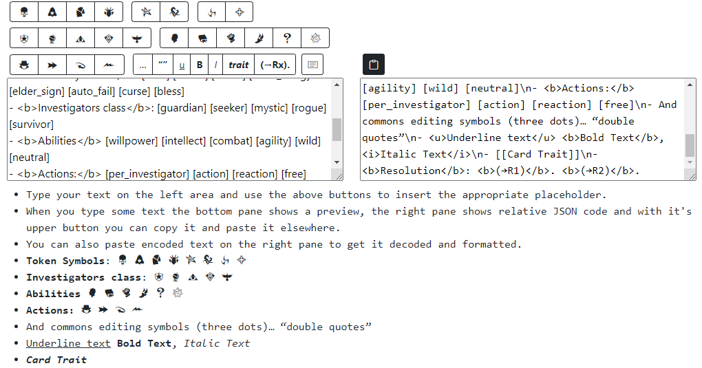
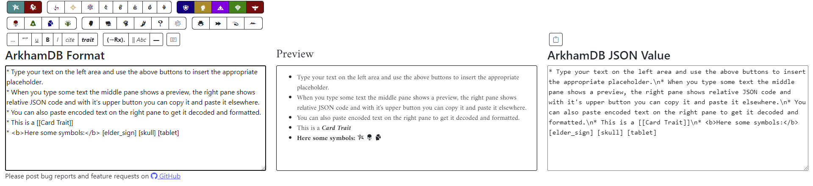

arkham-editor
=============

This simple utility helps the editing and previewing the data for 
[ArkhamDB](https://github.com/Kamalisk/arkhamdb-json-data) and 
[ArkhamCards](https://github.com/zzorba/arkham-cards-data)

How to use it
-------------

Launch Arkham Editor at the following URL: https://matteopic.github.io/arkham-editor/  

Type your text on the left side, use the buttons on top to insert appropriate formatting code.
When you are happy with the result shown in the bottom, you can copy the result on the right and paste as JSON string.
You can copy also some text from the projects and paste it on the right area, so you can edit it in comfortable way.

Samples
-------

